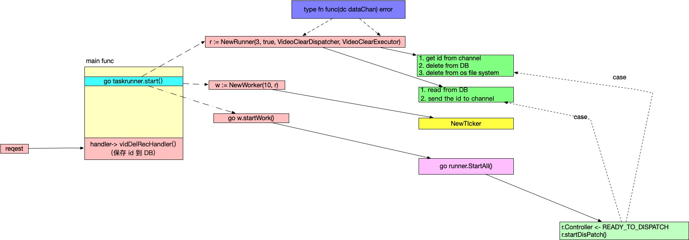

# Scheduler module

## For what?
Do tasks later by time,not instant task, like-async tasks. In this project need to delete video later.


## Includes
- RESTFUL http server
- Timer
- Producer/Consumer task runner


Module architecture:

## The whole workflow

### Defs

```go
// for control
type controlChan chan string
// data channel
type dataChan chan interface{}
// function
type fn func(dc dataChan) error
```

worker:
```go
type Worker struct {
	// ? ptr ?
	ticker *time.Ticker
	runner *Runner
}
```

Runner
```go
type Runner struct {
	Controller controlChan
	Error      controlChan
	Data       dataChan
	dataSize   int
	longLived  bool // to recycle or not
	Dispatcher fn
	Executor   fn
}
```


So the whole flow:
1. Start the task runner
    ```go
    r := NewRunner(3, true, VideoClearDispatcher, VideoClearExecutor)
	// 10 seconds
	w := NewWorker(10, r)
	go w.startWork()
    ```
   1. `NewRunner(3, true, VideoClearDispatcher, VideoClearExecutor)`
   2. `NewWorker(10, r)`
   3. `go w.startWork()`
2. Request access to handler
   1. Get the id
   2. Save to DB

The work flow:

